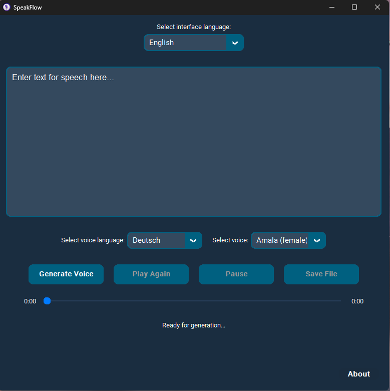
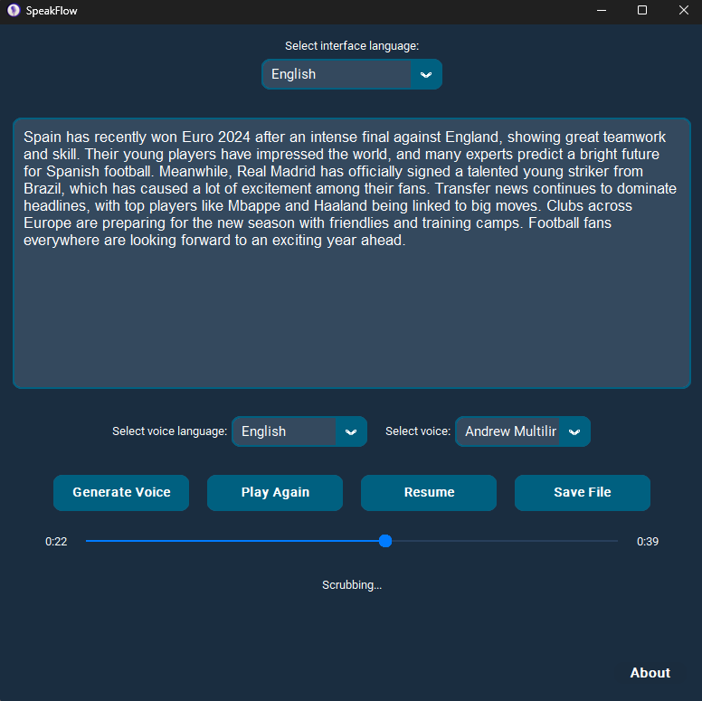
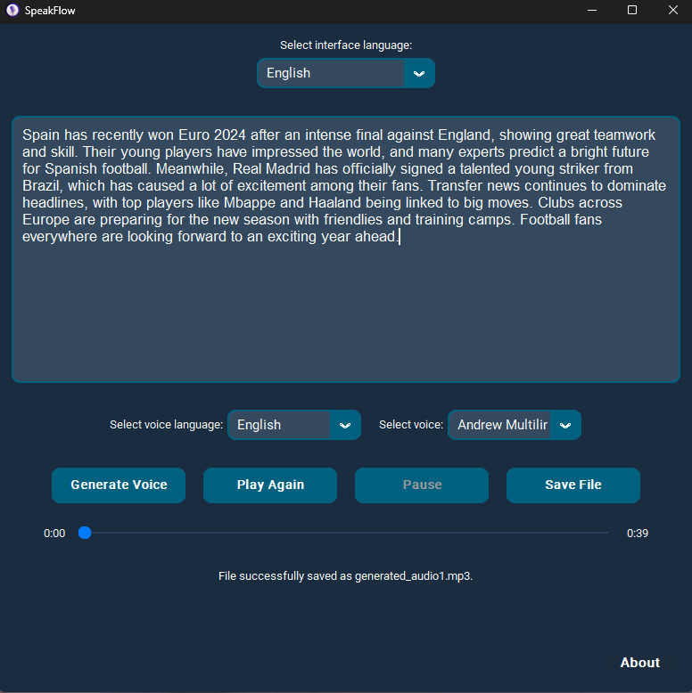
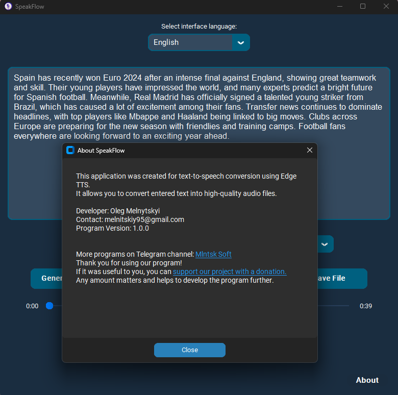

# SpeakFlow: Multilingual Voice Assistant (TTS)

## About the Project

SpeakFlow is an intuitive desktop application for text-to-speech (TTS) synthesis, designed to convert text documents into high-quality audio files. Utilizing the power of Edge TTS, it offers a wide selection of natural-sounding voices in multiple languages, allowing users to easily generate speech and save it in MP3 format.

### Key Features:
- **Multilingual Support:** Choose from a wide range of languages and voices (Ukrainian, English, German, Russian, Polish, French, Italian, Spanish, Portuguese, as well as multilingual voices for other languages).
- **Customizable Interface:** Supports multiple interface languages (Ukrainian, English, German).
- **Simple Interface:** Intuitive design for quick audio generation.
- **Save to MP3:** Save generated voice for offline use.
- **Audio Playback:** Instantly listen to the generated text.

## Screenshots

Here are a few screenshots of the SpeakFlow application:







## Installation and Running

### Running the Pre-built Application (for end-users)

The easiest way to run SpeakFlow is to download the compiled executable (.exe) from the [Releases](#releases) section of our repository.
1. Go to the [Releases](#releases) section.
2. Download the latest ZIP archive (e.g., `SpeakFlow_v1.0.0_Windows.zip`).
3. Unpack the archive to any folder on your computer.
4. Run `SpeakFlow.exe`.

### Running from Source Code (for developers)

If you wish to run the application from source code or make modifications:

1.  **Clone the repository:**
    ```bash
    git clone [https://github.com/Olegiiich/SpeakFlow.git](https://github.com/Olegiiich/SpeakFlow.git)
    cd SpeakFlow # Navigate into the project folder
    ```

2.  **Create and activate a virtual environment:**
    ```bash
    python -m venv .venv
    # For Windows (CMD):
    .venv\Scripts\activate
    # For Windows (PowerShell):
    .venv\Scripts\Activate.ps1
    # For macOS/Linux (if you happen to work there):
    source .venv/bin/activate
    ```

3.  **Install required dependencies:**
    ```bash
    pip install -r requirements.txt
    ```

4.  **Run the application:**
    ```bash
    python lecture_tts.py
    ```

## Support the Project

If you like SpeakFlow and find it useful, you can support our project with a donation. Your support helps us continue to develop the application and add new features.

[Support our project with a donation](https://www.paypal.com/donate/?hosted_button_id=WWSDL9ZDYZBCS)

## License

This project is licensed under the [MIT License](LICENSE).

## Contact

Have questions or suggestions? Contact us:
* Telegram channel: [Mlntsk Soft Channel](https://t.me/mlntsksoft)
* GitHub profile: [Olegiiich](https://github.com/Olegiiich)
* Email: melnitskiy95@gmail.com
